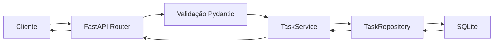
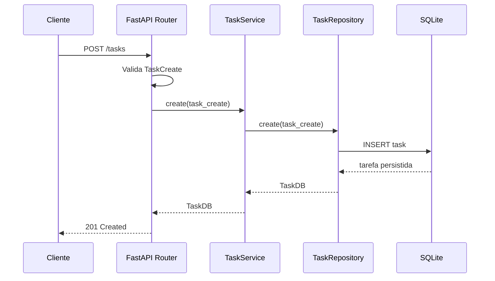

# API de Gerenciamento de Tarefas

## Visão Geral

Este projeto é um gerenciador de tarefas com backend em FastAPI e frontend estático. Ele permite criar, listar, atualizar, mover e excluir tarefas em um quadro visual com colunas de status, prazo, urgência e progresso de conclusão.

A aplicação foi organizada com uma estrutura em camadas para separar responsabilidades de API, regras de negócio, persistência, configuração e interface web.

## Funcionalidades

- Quadro de tarefas com colunas `A Fazer`, `Em andamento` e `Concluídas`.
- Criação de tarefas com título, descrição opcional e data de conclusão.
- Atualização de status por botão ou arrastar e soltar.
- Exclusão de tarefas.
- Indicadores de urgência por prazo:
  - verde: prazo confortável, a partir de depois de amanhã;
  - amarelo: tarefa vence amanhã;
  - vermelho: tarefa vence hoje ou está vencida;
  - neutro: tarefa concluída ou sem prazo.
- Barra de progresso baseada na quantidade de tarefas concluídas.
- Paginação e filtro por status na API.
- Rate limiting simples por IP.
- Logs estruturados em JSON.
- Erros padronizados.
- Migrações de banco com Alembic.
- Execução local ou via Docker.

## Tecnologias

- Python 3.10+
- FastAPI
- Uvicorn
- SQLAlchemy
- SQLite
- Alembic
- Pydantic
- Pydantic Settings
- Pytest
- HTTPX
- Docker

## Estrutura do Projeto

```txt
app/
  api/routes/        Rotas HTTP da API
  core/              Configuração, logs, erros, segurança e rate limit
  db/                Conexão com banco e modelos SQLAlchemy
  repositories/      Operações de persistência
  schemas/           Schemas Pydantic de entrada e saída
  services/          Regras de negócio
  static/            Frontend estático
alembic/             Migrações de banco
tests/               Testes automatizados
doc/                 Documentação complementar
```

## Como Executar Localmente

1. Crie o ambiente virtual:

```bash
python -m venv .venv
```

2. Ative o ambiente:

Windows:

```powershell
.venv\Scripts\Activate.ps1
```

macOS / Linux:

```bash
source .venv/bin/activate
```

3. Instale as dependências:

```bash
pip install -r requirements.txt
```

4. Opcionalmente, crie um arquivo `.env` a partir do exemplo:

```powershell
Copy-Item .env.example .env
```

5. Aplique as migrações do banco:

```bash
alembic upgrade head
```

6. Execute a aplicação:

```bash
uvicorn app.main:app --reload
```

7. Acesse a interface web:

```txt
http://localhost:8000/
```

8. Acesse a documentação automática da API:

```txt
http://localhost:8000/docs
```

## Executando com Makefile

```bash
make install
make migrate
make run
```

Outros comandos disponíveis:

```bash
make test
make docker-run
make docker-build
```

## Executando com Docker

```bash
docker compose up --build
```

Depois acesse:

```txt
http://localhost:8000/
```

O `docker-compose.yml` aplica as migrações antes de iniciar a API e persiste o banco SQLite em um volume Docker.

## Configuração

As principais variáveis de ambiente estão em `.env.example`:

```txt
APP_NAME=Task API
APP_DESCRIPTION=Servico de gerenciamento de tarefas com FastAPI.
APP_VERSION=1.0.0
ENVIRONMENT=development
DATABASE_URL=sqlite:///./tasks.db
RATE_LIMIT_MAX_REQUESTS=30
RATE_LIMIT_WINDOW_SECONDS=60
```

## Endpoints

- `POST /tasks` - cria uma nova tarefa.
- `GET /tasks` - lista tarefas com paginação e filtro opcional por status.
- `GET /tasks/{id}` - busca uma tarefa pelo UUID.
- `PUT /tasks/{id}` - atualiza parcialmente uma tarefa.
- `DELETE /tasks/{id}` - remove uma tarefa.

Parâmetros de `GET /tasks`:

- `skip`: quantidade de registros ignorados, padrão `0`.
- `limit`: quantidade máxima de registros, padrão `50`, máximo `100`.
- `status`: filtro opcional com `todo`, `in_progress` ou `done`.

Exemplo de resposta de `GET /tasks`:

```json
{
  "items": [
    {
      "id": "7d879d2c-78b8-48af-9e0d-7f0b60d9ce0f",
      "title": "Escrever testes",
      "description": "Cobrir fluxo principal",
      "status": "todo",
      "owner_id": null,
      "created_at": "2026-05-01T12:00:00",
      "due_date": "2026-05-03"
    }
  ],
  "total": 1,
  "skip": 0,
  "limit": 50
}
```

As rotas aceitam o cabeçalho opcional `X-User-Id`. Ele prepara o projeto para autenticação futura e permite isolar tarefas por usuário quando informado.

## Formato de Erros

As respostas de erro seguem um formato padronizado:

```json
{
  "error": {
    "code": "VALIDATION_ERROR",
    "message": "Request validation failed",
    "details": []
  }
}
```

## Arquitetura

O fluxo principal segue a separação:

```txt
Cliente -> FastAPI Router -> TaskService -> TaskRepository -> SQLite
```



## Fluxo de Criação de Tarefa



## Testes

Para executar os testes:

```bash
pytest tests/ -v
```

Ou:

```bash
make test
```

Os testes usam SQLite em memória, evitando alterações no banco local `tasks.db`.

## Migrações

Para aplicar migrações:

```bash
alembic upgrade head
```

Para criar uma nova migração automática após alterar modelos SQLAlchemy:

```bash
alembic revision --autogenerate -m "descricao da alteracao"
```

Ou pelo Makefile:

```bash
make revision message="descricao da alteracao"
```

## Como Usar

1. Abra `http://localhost:8000/`.
2. Preencha título, descrição e data de conclusão.
3. Clique em `Adicionar tarefa`.
4. Mova a tarefa entre colunas pelo botão ou por arrastar e soltar.
5. Use os indicadores do topo para acompanhar urgência e progresso.

## Segurança e Boas Práticas

- Não versionar `.env`, bancos locais ou credenciais.
- Usar variáveis de ambiente para configuração por ambiente.
- Manter migrações versionadas com Alembic.
- Manter testes isolados do banco local.
- Usar logs estruturados para facilitar análise de erros.
- Usar respostas de erro consistentes para facilitar integração com frontend e clientes externos.

## Observações

- O campo `due_date` aceita data no formato `YYYY-MM-DD`.
- Datas de prazo são tratadas como datas locais no frontend para evitar deslocamento por fuso horário.
- Tarefas concluídas não recebem indicação ativa de urgência.
- O frontend é servido por `app/main.py` e os arquivos estáticos ficam em `app/static`.
