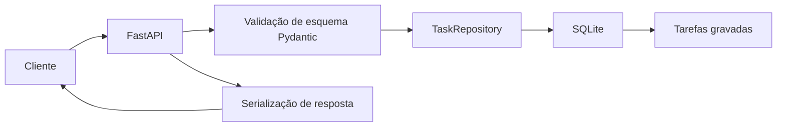
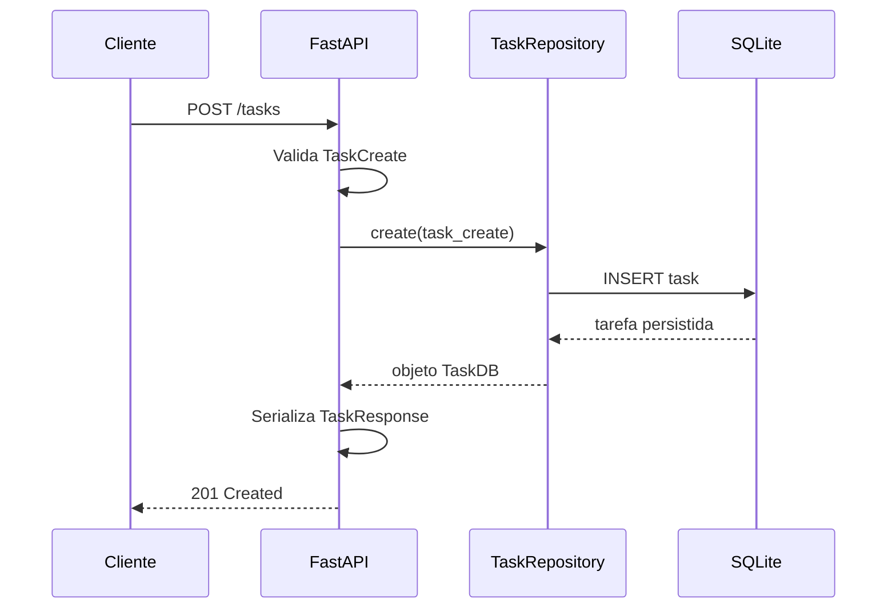

# API de Gerenciamento de Tarefas

## Visão Geral

Este projeto é um gerenciador de tarefas com backend em FastAPI e frontend estático que ajuda o usuário a acompanhar metas, prazos e progresso do trabalho. A aplicação suporta criação, atualização parcial, exclusão e listagem de tarefas, além de apresentar um painel visual com urgência de prazo e progresso de meta.

## Storytelling: Como a IA Acelerou Este Projeto

Este projeto foi desenvolvido com a ajuda de ferramentas de IA como Copilot e Cursor, que permitiram:

✨ Geração rápida da estrutura base da API REST

✨ Automação de testes unitários com pytest

✨ Documentação automática com OpenAPI/Swagger

✨ Sugestões de boas práticas e refatoração

## Limitações identificadas e melhorias implementadas

⚠️ A IA gerou código sem considerar rate limiting

⚠️ Faltou validação de entrada em alguns endpoints

⚠️ Logs não foram estruturados adequadamente

⚠️ Segurança: credenciais devem ser mantidas fora do repositório e não commitadas

As melhorias mais recentes incluem:

- Limitação de taxa simples por IP para proteger a API de chamadas abusivas.
- Logs estruturados para capturar tempo de processamento e status de resposta.
- Tratamento global de erros para validações e exceções internas.
- `.gitignore` atualizado para excluir ambiente virtual e banco local.

## Tecnologias

- Python 3.10+
- FastAPI
- SQLAlchemy
- SQLite
- Pytest
- HTTPX
- Uvicorn

## Como executar

1. Crie o ambiente virtual:

```bash
python -m venv .venv
```

2. Ative o ambiente:

Windows:

```powershell
.venv\Scripts\Activate.ps1
```

macOS / Linux:

```bash
source .venv/bin/activate
```

3. Instale as dependências:

```bash
pip install -r requirements.txt
```

4. Execute a aplicação:

```bash
uvicorn app.main:app --reload
```

5. Acesse a interface web:

- `http://127.0.0.1:8000`

6. Acesse a documentação automática (Swagger):

- `http://127.0.0.1:8000/docs`

## Funcionalidades

- painel visual de tarefas com colunas: `A Fazer`, `Em andamento` e `Concluídas`
- criação de tarefas com título, descrição opcional e data de conclusão
- arrastar e soltar tarefas entre colunas para atualizar status
- indicação de urgência por cor:
  - verde: prazo confortável
  - amarelo: atenção necessária
  - vermelho: tarefa urgente ou vencida
- barra de progresso de meta baseada em tarefas concluídas
- contadores dinâmicos com status geral das tarefas
- limitação de taxa simples por IP para reduzir uso abusivo da API

## Arquitetura

O sistema segue uma separação de responsabilidades entre API, modelos, persistência e frontend.



## Fluxo de requisição



## Testes

Para executar o conjunto de testes com pytest:

```bash
pytest
```

Ou use o Makefile:

```bash
make test
```

Este projeto inclui testes de unidade e um teste de integração para verificar o comportamento do rate limiter, garantindo que a API retorne `429 Too Many Requests` quando o limite de chamadas for excedido.

## Endpoints disponíveis

- `POST /tasks` - cria uma nova tarefa
- `GET /tasks` - lista tarefas com filtros opcionais `skip`, `limit` e `status`
- `GET /tasks/{id}` - obtém uma tarefa pelo UUID
- `PUT /tasks/{id}` - atualiza parcialmente uma tarefa
- `DELETE /tasks/{id}` - remove uma tarefa

## Como usar

1. Abra a interface web em `http://127.0.0.1:8000`
2. Preencha título, descrição e data de conclusão
3. Arraste a tarefa para `Em andamento` ou `Concluídas`
4. Use o painel no topo para identificar rapidamente o que está em dia, em atenção ou urgente

## Segurança

- Garanta que credenciais e segredos não fiquem versionados.
- Adicione `.env` e arquivos sensíveis ao `.gitignore`.
- Use variáveis de ambiente para qualquer configuração de produção.

## Boas práticas aplicadas

- Limitação de taxa simples por IP para reduzir uso abusivo da API.
- Logs estruturados com tempo de processamento e status de resposta.
- Tratamento de erros globais para validações e exceções internas.
- Arquivo `.gitignore` criado para evitar envio de ambiente virtual e dados locais.

## Observações

- O campo `due_date` aceita apenas data no formato `YYYY-MM-DD`.
- Tarefas concluídas não recebem mais indicação de urgência.
- O frontend é servido via `app/main.py` e os arquivos estáticos estão em `app/static`.
